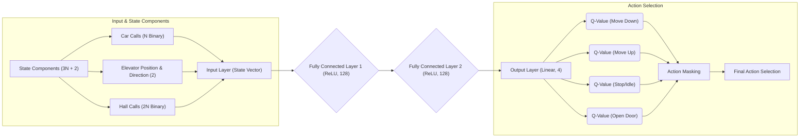

**![A black background with orange and blue textAI-generated content may be incorrect.][image1]**

**REINFORCEMENT LEARNING PROGRAMMING PROJECT**

**Report 3 – RL Agent**

– Hanoi, October 2025 –

**[III. Reinforcement Learning Agent	3](#iii.-reinforcement-learning-agent)**

[1\. Agent Selection: Double Deep Q-Learning	3](#1.-agent-selection:-double-deep-q-learning)

[1.1 Rationale for DDQN	3](#1.1-rationale-for-ddqn)

[2.1 Deep Neural Network Policy Architecture	3](#2.1-deep-neural-network-policy-architecture)

[2.2 Experience Replay Mechanism	4](#2.2-experience-replay-mechanism)

[2.3 Dual Network Structure and Target Calculation	4](#2.3-dual-network-structure-and-target-calculation)

[3\. Training Methodology and Optimization	4](#3.-training-methodology-and-optimization)

[4\. Action Masking for Practical Constraints	6](#4.-action-masking-for-practical-constraints)

[REFERENCES	6](#references)

# **III. Reinforcement Learning Agent** {#iii.-reinforcement-learning-agent}

This report details the design and implementation of the Reinforcement Learning (RL) agent intended to solve the Elevator Group Control System (EGCS) problem as modeled in the Gym environment described in Report 2\. Given the discrete nature of the action space and the complexity of the state space, we selected the Double Deep Q-Network (DDQN) algorithm as the core learning mechanism.

## **1\. Agent Selection: Double Deep Q-Learning**  {#1.-agent-selection:-double-deep-q-learning}

The EGCS problem is fundamentally a sequential decision-making task framed as a Markov Decision Process (MDP). Deep Q-Learning (DQN) provides the means to estimate the optimal action-value function, Q(s,a), through the application of deep neural networks. The DDQN algorithm, as introduced by Van Hasselt et al. \[2\], serves as an enhancement to the original DQN, specifically addressing the issue of positive bias in Q-value estimation.

### ***1.1 Rationale for DDQN*** {#1.1-rationale-for-ddqn}

The DDQN approach offers significant advantages for the control of elevator systems, where optimizing long-term cumulative reward (i.e., minimizing aggregate passenger wait and travel times) is paramount. The algorithm enhances training stability and improves the quality of the final learned policy through critical decoupling. This stability is achieved by separating the network responsible for selecting the optimal action in the next state from the network used for evaluating the Q-value of that selected action. Furthermore, the capacity of the deep neural network within the DDQN framework is essential for generalizing across the complex, multi-component state representation defined in Report 2\. Finally, the native structure of Q-learning is well-matched to the discrete action space (Move Up, Move Down, Stop/Idle, Open Door) of the EGCS.

### ***2.1 Deep Neural Network Policy Architecture*** {#2.1-deep-neural-network-policy-architecture}

- Minor wording and input/output notation aligned to Report 2:

The architecture is updated for M elevators and N floors as follows:

- Input layer dimension = State_size = M*N [per‑elevator car calls] + 2N [hall calls] + 2M [elevator positions + directions] (same formula as Report 2).  
- Output layer: the network emits M blocks of 4 Q‑values (concatenated) — total outputs = M * 4. Each 4‑way head corresponds to the 4 high‑level commands for one elevator.

Action selection: for a state s, the network returns a tensor Q(s) shaped (M,4). For each elevator e we apply an action mask (set illegal actions to −∞) and then select Ae = argmax_a Q_masked[e,a]. Exploration (ε‑greedy) can be applied independently per elevator (flip a coin per elevator) or jointly; the document uses a per‑elevator ε for simplicity.

*Figure 1\. Deep Neural Network Policy Architecture diagram*

### ***2.2 Experience Replay Mechanism***  {#2.2-experience-replay-mechanism}

The stability of the deep RL approach hinges on decorrelating the observed samples. To achieve this, an Experience Replay Buffer stores transitions in the format (st,at,rt+1,st+1,done).

During the optimization phase, a uniformly random batch of transitions is sampled from this buffer. This procedure ensures that the agent's learning updates are not dominated by recent, sequential environmental interactions, thereby mitigating oscillation and non-convergence issues. A typical buffer capacity is maintained in the range of 105 to 106 transitions.

### ***2.3 Dual Network Structure and Target Calculation*** {#2.3-dual-network-structure-and-target-calculation}

- Clarify target computation is done per‑elevator and aggregated for the loss (keeps DDQN logic unchanged).

The DDQN target extends naturally: for each transition in the minibatch and for each elevator e, let a*_{j,e} = argmax_a Q_{\theta}(s_{j+1})[e,a] after masking illegal actions in s_{j+1}. Then:

- If done_j: Y_{j,e} = r_{j+1}  
- Else: Y_{j,e} = r_{j+1} + γ * Q_{\theta'}(s_{j+1})[e, a*_{j,e}]

Loss is computed as the mean squared error averaged across elevators and batch:
Loss = mean_j mean_e ( Q_{\theta}(s_j)[e, a_{j,e}] − Y_{j,e} )^2

This keeps the same DDQN decoupling: policy network selects best next per‑elevator action; target network evaluates.

## **3\. Training Methodology and Optimization** {#3.-training-methodology-and-optimization}

The DDQN agent is trained through continuous interaction with the stochastic EGCS environment across numerous episodes, following the iterative structure of the MDP.

**DDQN Training Procedure for EGCS**

***

### Input Parameters

* $\gamma$: **Discount factor** (e.g., 0.99)
* $\alpha$: **Learning rate** (e.g., $10^{-4}$)
* $M$: **Replay buffer capacity** (e.g., $10^5$)
* $N_{batch}$: **Minibatch size** (e.g., 64)
* $C$: **Target network update frequency** (e.g., 10,000 steps)
* $\epsilon_{start}, \epsilon_{end}, \epsilon_{decay}$: $\epsilon$-**greedy annealing parameters**
* $N_{episodes}$: **Total number of training episodes**

***

### Initialization

1.  Initialize **Policy Network $Q_{\theta}$** with random weights $\theta$.
2.  Initialize **Target Network $Q_{\theta'}$** with weights $\theta' \gets \theta$.
3.  Initialize **Replay Buffer $\mathcal{D}$** to capacity $M$.
4.  Initialize current step counter $\text{global\_step} \gets 0$.
5.  Initialize $\epsilon \gets \epsilon_{start}$.
6.  Initialize loss function $\mathcal{L} \leftarrow \text{Mean Squared Error}$.

***

### Training Loop

**For** $\text{episode} = 1$ to $N_{episodes}$:

1.  $S_t \gets \text{Environment.reset()}$
2.  $\texttt{done} \gets \texttt{False}$

    **While** $\texttt{done} = \texttt{False}$:
    * $\text{global\_step} \gets \text{global\_step} + 1$

        #### 1. Action Selection ($\epsilon$-Greedy):

        * **If** $\text{random number} < \epsilon$:
            * $A_t \gets \text{random feasible action}$ (**Exploration**)
        * **Else**:
            * $\mathbf{Q} \leftarrow Q_{\theta}(S_t)$ (Estimate Q-values for all actions)
            * $\mathbf{Q}_{\text{masked}} \leftarrow \text{ActionMask}(\mathbf{Q}, S_t)$ (Set illegal actions to $-\infty$)
            * $A_t \gets \arg \max_{a} \mathbf{Q}_{\text{masked}}$ (**Exploitation**)
        * **EndIf**

        #### 2. Environment Interaction:

        * $S_{t+1}, R_{t+1}, \texttt{done} \gets \text{Environment.step}(A_t)$ (Execute action and receive reward)

        #### 3. Store Transition:

        * $\mathcal{D}.\text{store}(S_t, A_t, R_{t+1}, S_{t+1}, \texttt{done})$

        #### 4. Optimization (Learning):

        * **If** $\mathcal{D}.\text{size} \geq N_{batch}$:
            * Sample batch $\mathcal{B} = \{(s_j, a_j, r_{j+1}, s_{j+1}, \texttt{done}_j)\}$ from $\mathcal{D}$

            * **For** each transition $j$ in $\mathcal{B}$:
                * $\mathbf{Q}_{s'} \leftarrow Q_{\theta}(s_{j+1})$
                * $\mathbf{Q}_{\text{masked}, s'} \leftarrow \text{ActionMask}(\mathbf{Q}_{s'}, s_{j+1})$
                * $a^* \leftarrow \arg \max_{a} \mathbf{Q}_{\text{masked}, s'}$ (Select best action using **Policy Network $Q_{\theta}$**)

                * **If** $\texttt{done}_j = \texttt{True}$:
                    * $Y_j \leftarrow r_{j+1}$
                * **Else**:
                    * $Y_j \leftarrow r_{j+1} + \gamma \cdot Q_{\theta'}(s_{j+1}, a^*)$ (Evaluate using **Target Network $Q_{\theta'}$**)
                * **EndIf**

                * $\text{Loss}_j \leftarrow \mathcal{L}(Q_{\theta}(s_j, a_j), Y_j)$
            * **EndFor**
            * Update $\theta$ by performing **gradient descent** on $\sum \text{Loss}_j$
        * **EndIf**

        #### 5. Target Network Update:

        * **If** $\text{global\_step} \equiv 0 \pmod{C}$:
            * $\theta' \leftarrow \theta$ (**Hard update** Target Network)
        * **EndIf**

        #### 6. Exploration Decay:

        * $\epsilon \leftarrow \max(\epsilon_{end}, \epsilon \cdot \epsilon_{decay})$

        * $S_t \gets S_{t+1}$

    **EndWhile**

**EndFor**

## **4\. Action Masking for Practical Constraints** {#4.-action-masking-for-practical-constraints}

Action masking is applied per elevator: for elevator e in state s, illegal actions (e.g., Move Down at ground, Open Door while moving) are set to −∞ before both greedy selection and before selecting a* for the DDQN target computation. Masking ensures feasibility and reduces exploration waste.

### Practical improvements (brief)

- Consider centralized training with decentralized execution (CTDE) or multi‑agent RL (VDN / QMIX).  
- Factorised action/value heads and parameter sharing reduce sample complexity.  
- Prioritized replay, dueling heads, distributional RL, or soft (Polyak) target updates improve stability.  
- Curriculum traffic generation and reward shaping speed up convergence.

## **REFERENCES** {#references}

\[1\] Mnih, V., Kavukcuoglu, K., Silver, D., Graves, A., Antonoglou, I., Wierstra, D., & Riedmiller, M. (2013). Playing Atari with Deep Reinforcement Learning. *arXiv preprint arXiv:1312.5602*.

\[2\] Van Hasselt, H., Guez, A., & Silver, D. (2016). Deep Reinforcement Learning with Double Q-learning. In *Proceedings of the Thirtieth AAAI Conference on Artificial Intelligence*.
